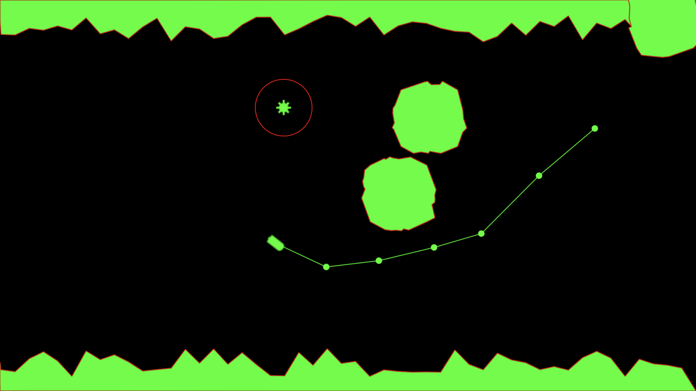

# Trench Navigator

This is a small prototype/experiment in using Apple's 2D game library SpriteKit for iOS.

The player controls a submarine which they were eventually supposed to navigate through a deep sea
trench maze, avoiding obstacles such as sea mines.

Each run gets randomly generated trench walls, however, I never got as far as actually expanding
this into a maze. Currently it is just the one screen.

The player controls the submarine by tapping to add waypoints for it to follow. The player cannot
tap inside of walls or obstacles. Video here: https://youtu.be/ysos4tfBXz8

I did make some progress with seamines, I made a little object that chases the player if they get
within its range (signified with a red circle). Video here: https://youtu.be/5kbdYRBtjO0

